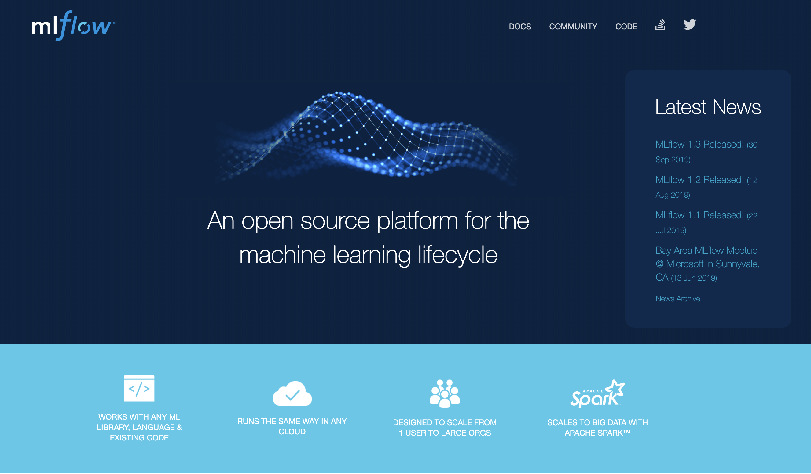
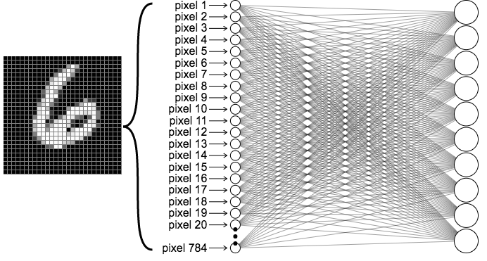
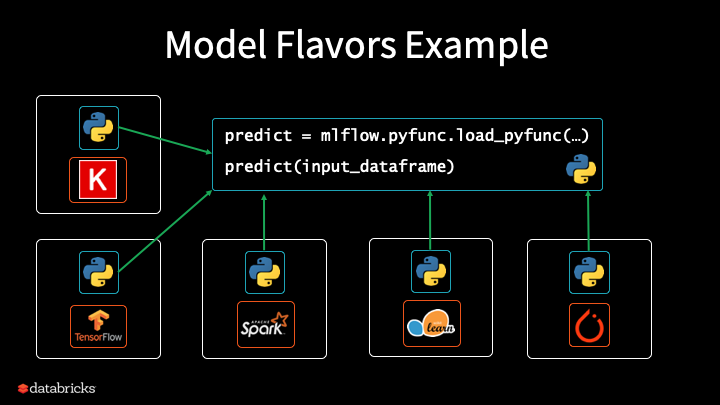
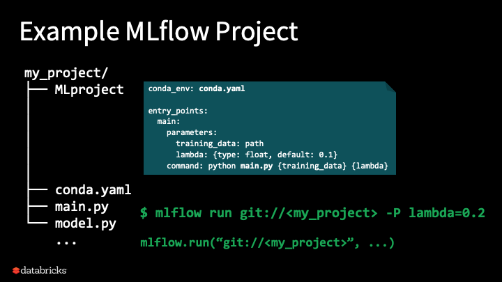

# MLflow Tutorial for Start Conference New York, 2019
## Agenda
 * Introduction
 * MLflow: What, Why, and How
  * MLflow Concepts: 
    * Philosophy & Motivation
    * Tracking, Projects & Models
    * Deployment
  * Road Map 1.x
  * Community and Adoption
  * Get Involved!
  * Managed MLflow Demo
 * Q & A
 * break?
 * Setting up your environment
 * Hands-on Tutorials
 
### Prerequisites 
1. Knowledge of Python 3 and programming in general
2. Preferably a UNIX-based, fully-charged laptop with 8-16 GB, with a Chrome or Fixfox browser
3. Familiarity with GitHub, git, and an account on Github
4. Some Knowledge of some Machine Learning concepts, libraries, and frameworks 
     * scikit-Learn
     * pandas and Numpy
     * TensorFlow/Keras
5. PyCharm/IntelliJ or choice of sytnax-highligted Python editor
6. pip/pip3 and Python 3 installed
7. Loads of laughter, curiosity, and sense of humor ... :-)

### Installation and Setup environment

1. Open MLflow [docs](https://mlflow.org) and scikit-learn[docs](https://scikit-learn.org/stable/index.html) in your browser. Keep this tab open.
2. `git clone git@github.com:dmatrix/spark-saturday.git`
3. `cd <your_cloned_directory>/tutorials/mlflow/src/python`
4. Install MLflow and the required Python modules 
    * `pip install -r req.txt` or `pip3 install -r req.txt`
5. `cd labs`
6. If using PyCharm or IntelliJ, create a project and load source files in the project

### Documentation Resources

1. [MLflow](https://mlflow.org/docs/latest/index.html) 
2. [Numpy](https://numpy.org/devdocs/user/quickstart.html)
3. [Pandas](https://pandas.pydata.org/pandas-docs/stable/reference/index.html)
4. [Scikit-Learn](https://scikit-learn.org/stable/index.html)
5. [Keras](https://keras.io/optimizers/)

## Labs 
The general objective of the labs are to create a baseline or a benchmark model,
followed by creating experimental models by tuning parameters to produce a better outcome. 
This is achieved by experimenting and tracking the effects, using MLflow and MLflow tracking
APIs. In simple terms:

1. Train a base line model with initial parameters
2. Record the relevant metrics and parameters with MLflow APIs
3. Observe the results via MLflow UI
4. Change or tweak relevant parameters
5. Test or evaluate model
6. Repeat 2-5 until satisfied

This iterative process is recurrent in each of the lab, as part of model management life cycle. 

### Lab-1: Scikit-Learn Regression with RandomForestRegressor 
 [_petrol_regression_lab_1.py_](./labs/petrol_regression_lab_1.py)
### Problem
Part 1: We want to predict the gas consumption in millions of gallons in 48 of the US states
based on some key features. These features are petrol tax (in cents), per capital income (in US dollars),
paved highway (in miles), population of people with driving licences.
### Solution
Since this is a regression problem where the value is a range of numbers, we can use the
common Random Forest Algorithm in Scikit-Learn. Most regression models are evaluated with
three standard evalution metrics: Mean Absolute Error(MAE); Mean Squared Error (MSE); and
Root Mean Squared Error (RSME), and r2 score.

### Sample Data
|Petrol_tax	|Average_income|	Paved_Highways|	Population_Driver_license(%)|	Petrol_Consumption|
|-----------|--------------|------------------|-----------------------------|---------------------|
|9.0	    |    3571	   |     1976	      | 0.525	                    |   541               |
|9.0	    |    4092	   |     1250	      | 0.572	                    |   524               |
|9.0	    |   3865	   |     1586	      | 0.580	                    |   561               |
|7.5	    |   4870	   |     2351	      | 0.529	                    |   414               |
|8.0	    |   4399	   |     431	      | 0.544	                    |   410               |

 Objectives of this Lab: 
 
 * Use _RandomForestRegressor_ Model
 * How to use the MLflow API
 * Use the MLflow API to experiment several Runs
 * Interpret and observe runs via the MLflow UI
 
#### Lab-1 Exercise: 

 1. Consult [RandomForestRegressor](https://scikit-learn.org/stable/modules/generated/sklearn.ensemble.RandomForestRegressor.html) documentation 
 2. Change or add parameters, such as depth of the tree or random_state: 42 etc.
 3. Change or alter the range of runs and increments of n_estimators
 4. Check in MLfow UI if the metrics are affected
 
 *_challenge-1_:* Create mean square error and r2 artifacts and save them for each run
 
 *_challenge-2_:* Use linear regression model and see if it makes a difference in the evaluation metrics

 Refresh on [Regression Metrics](https://www.dataquest.io/blog/understanding-regression-error-metrics/)
 
 Refresh on [RandomForest](https://towardsdatascience.com/understanding-random-forest-58381e0602d2)
 
 Source for [Lab 1 & 2](https://stackabuse.com/random-forest-algorithm-with-python-and-scikit-learn/)
 
 Data source for [lab 1 & 2](https://archive.ics.uci.edu/ml/datasets/banknote+authentication)

### Lab-2: Scikit-Learn Classification with RandomForestClassifier
* [_banknote_classification_lab_2.py_](./labs/banknote_classification_lab_2.py)

### Problem
Part 2: Given a set of features or attributes of a bank note, can we predict whether it's authentic or fake?
Four attributes, extracted from wavelet transformed images, contribute as independent variables to this classification:

 1. Image.Var (Variance of Wavelet Transformed image (WTI))
 2. Image.Skew (Skewness of WTI)
 3. Image.Curt (Curtosis of WTI)
 4. Entropy (Entropy of image)
 5. Class (Whether or not the banknote was authentic; zero=fake; one=authentic)
### Solution
We are going to use Random Forest Classification to make the prediction, and measure on the accuracy.
The closer to 1.0 is the accuracy the better is our confidence in its prediction.
### Sample Data
|Variance	|Skewness      |	Curtosis|	Entropy|	Class|
|-----------|--------------|------------|----------|---------|
|3.62160	|   8.6661	   |     -2.807 | -0.44699 |   0     |
|4.54590    |   8.1674     |    -2.4586 | -1.46210 |   0     |
|3.86600    |   -2.6383    |   1.9242   | 0.10645  |   0     |
|3.45660    |  9.5228	   |    4.0112  | -3.59440|    0     |

Objectives of this lab:
 * Use a RandomForestClassification Model
 * How to use the MLflow Tracking API
 * Use the MLflow API to experiment several runs
 * Interpret and observe runs via the MLflow UI
 
#### Lab-2 Exercise: 
  * Consult [RandomForestClassifier](https://scikit-learn.org/stable/modules/generated/sklearn.ensemble.RandomForestClassifier.html) documentation
  * Change or add parameters, such as depth of the tree or random_state, etc.
  * Change or alter the range of runs and increments of n_estimators
  * Check in MLflow UI if the metrics are affected
  * Log confusion matrix, recall and F1-score as metrics
   
 *_challenge-1_:* Use linear regression or SVM algorithm and see if it makes a difference in the evaluation metrics. This is a classic scenario where
 MLflow allows you to experiment, record, and evaluate three different algorithms to pick the best one, after
 experimentation and evaluation. 
 **Hint**: Read the blog below on using three algorithms
 
 Nice blog on [RF, SVM, & LR](https://www.vshsolutions.com/blogs/banknote-authentication-using-machine-learning-algorithms/) on detecting fake notes

 Nice blog on [TensorFlow and scikit-learn](https://medium.com/tensorist/detecting-fake-banknotes-using-tensorflow-be21ffd2c478) on detecting fake notes

 Refresh on [Classification Metrics](https://joshlawman.com/metrics-classification-report-breakdown-precision-recall-f1/)
 
 Refresh on [RandomForest](https://towardsdatascience.com/understanding-random-forest-58381e0602d2)
 
 Source for [Lab 1 & 2](https://stackabuse.com/random-forest-algorithm-with-python-and-scikit-learn/)
 
 Data source for [lab 1 & 2](https://archive.ics.uci.edu/ml/datasets/banknote+authentication)

### Lab-3: Scikit-Learn Regression Base with RandomForestRegressor 
  * [_airbnb_base_lab_3.py_](./labs/airbnb_base_lab_3.py)
### Problem
Take a cleansed, featurized dataset from AirBnB listing and develop a base line model to predict prices.  
### Solution
Use RandomForestRegressor and baseline  parameters to predict the price, given all the features.
### Sample Data
|host_total_listings_count|neighbourhood_cleansed|zipcode|latitude|longitude|property_type|room_type|accommodates|bathrooms|bedrooms|beds|bed_type|minimum_nights|number_of_reviews|review_scores_rating|review_scores_accuracy|review_scores_cleanliness|review_scores_checkin|review_scores_communication|review_scores_location|review_scores_value|price|
|-------------------------|----------------------|-------|--------|---------|-------------|---------|------------|---------|--------|----|--------|--------------|-----------------|--------------------|----------------------|-------------------------|---------------------|---------------------------|----------------------|-------------------|-----|
|1.0|0|0|37.769310377340766|-122.43385634488999|0|0|3.0|1.0|1.0|2.0|0|1.0|127.0|97.0|10.0|10.0|10.0|10.0|10.0|10.0|170.0|
|2.0|1|1|37.745112331410034|-122.42101788836888|0|0|5.0|1.0|2.0|3.0|0|30.0|112.0|98.0|10.0|10.0|10.0|10.0|10.0|9.0|235.0|
|10.0|2|0|37.766689597862175|-122.45250461761628|0|1|2.0|4.0|1.0|1.0|0|32.0|17.0|85.0|8.0|8.0|9.0|9.0|9.0|8.0| 65.0|

Objectives of this lab:
 * Create a benchmark or base model 
 * How to use the MLflow Tracking API
 * Interpret and observe runs via the MLflow UI
  
#### Lab-3 Exercise: 
  *  Run script and create a simple base line model
  *  Observe the parameters and metrics in the MLflow UI
  
  [Related code](https://github.com/MangoTheCat/Modelling-Airbnb-Prices) for this model.
  
### Lab-4: Scikit-Learn Regression Experimental with RandomForestRegressor
* [_airbnb_exp_lab_4.py_](./labs/airbnb_exp_lab_4.py)
### Problem
Can you extend the baseline model built in lab 3 to build several experimental models?
### Solution
Use the existing model and make changes to code to experiment with model parameters.
 
Objectives of this lab:
 * Create experiments and log meterics and parameters
 * Interpret and observe runs via the MLflow UI
 * How to use _MLflowClient()_ API to peruse experiment details
 
 Nice read on [Feature Importance](https://towardsdatascience.com/explaining-feature-importance-by-example-of-a-random-forest-d9166011959e) in Random Forest model.
 
#### Lab-4 Exercise: 
  * Modify or extend the parameters
  * Compare the results between baseline and experimental runs
  * Did the experimental runs produce better outcomes of metrics?
  * Did the RMSE decrease over the experiments

[Related code](https://github.com/MangoTheCat/Modelling-Airbnb-Prices) for this model.
  
Nice read on[feature importance](https://towardsdatascience.com/explaining-feature-importance-by-example-of-a-random-forest-d9166011959e)
 
Nice read on [residual plots](http://docs.statwing.com/interpreting-residual-plots-to-improve-your-regression/)
 
### Lab-5 : Deep Learning Neural Networks for Classification
* [_keras_mnist_lab_5.py_](./labs/keras_mnist_lab_5.py) 
Modified from [MLflow example](https://github.com/dbczumar/mlflow-keras-ffnn-mnist/blob/master/train.py)

### MNIST Neural Network with Layers

### Problem
Build a Keras/TensorFlow Neural Network to classify digital digits from 0-9
### Solution
Use Keras Sequential Layers to build input, hidden, and outut layers.
### Sample Data
Use the built in MNIST dataset available via dataset module `keras.datasets.mnist`

Objectives of this lab:
 * Introduce Keras NN Model
 * Create your own experiment name and log runs under it
 * Use various optimzation techniques to get the best outcome
 
#### Lab Exercise: 
 * Consult [Keras Sequential Model](https://keras.io/getting-started/sequential-model-guide/) documentation
 * Change or modify Neural Network and regularization parameters
    * Add hidden layers
    * Make hidden units larger
    * Try a different [Keras optimizers](https://keras.io/optimizers/): RMSprop and Adadelta
    * Train for more epochs
 * Log parameters, metrics, and the model
 * Check MLflow UI and compare metrics among different runs

### Lab-6: Loading and predicting an existing model 
* [_load_predict_model_lab_6.py_](./labs/load_predict_model_lab_6.py)

### Problem
Having experimented several runs from lab 1-5, can can you reuse the model to predict?
### Solution
Load an existing model by extending or modifying code to reload the saved model and 
use test data on its _model_.predict(test_data) method.

Objectives of this lab:
 * load an existing model and predicting with test data
 * load model as pyfunc function
 * understand MLflow model flavors that can deployed and loaded in different deployment
 environments.
 
 *challenge-1:* Can you load and predict other models from the labs?
  * Lab-3, lab-4 or lab-5?
 
#### Lab Exercise: 
 * Extend the _MLflowOps_ class private instance dictionary of 
 function mappers to include [pyfunc](https://mlflow.org/docs/latest/python_api/mlflow.pyfunc.html#mlflow.pyfunc.load_model) model
 * Use a couple of the run_uid from your Lab-1 runs. 
  * Check your MLflow UI for run_uids
 * Use the _load_model_type.predict(test_data)_ to predict the outcome
 
### Lab-7 (optional): Executing MLproject from GitHub

Objectives of this lab:
 * Understanding MLflow Project files
 * Running MLflow Project as unit of execution
 
#### Lab Exercise:
 * Execute an existing MLproject on git
 * Consult [docs](https://mlflow.org/docs/latest/quickstart.html#running-mlflow-projects) for running MLprojects
 * Can you execute it with different parameters?
 * `mlflow run https://github.com/mlflow/mlflow-example.git -P alpha=5`
 * with no-conda use `mlflow run --no-conda https://github.com/mlflow/mlflow-example.git -P alpha=5`
 
  *_challenge-1_:* 
  * Create a an MLproject on your github for one of above labs
  * Execute the MLproject with `mlflow run https://github.com/<your_example.git> [-P args...]`

### Lab-8 (Capstone): Create, experiment, and manage your model of choice

Objectives of this lab:
 * Use and build whatever you have learned from above
 
#### Lab Exercise:
 * Create a Python script for your model example
 * Consult [MLflow](https://mlflow.org/docs/latest/python_api/mlflow.html) and [Tracking APIs](https://mlflow.org/docs/latest/python_api/mlflow.tracking.html):
    * compute relevant metrics
    * log individual or bulk parameters and metrics
    * add tags or notes for your runs
    * create a distinct experiment name
    * experiment different parameters with each run under this experiment
    * can you create appropriate artifacts (using matplotlib) and save them?
    * consult MLflow UI to pick the best model
    * can you load the best model using native model or pyfunc?
    * can you predict with test data?
    
Some possible choices to use or modify:

1. [TensorFlow/Keras MNIST fashion Model](https://www.tensorflow.org/tutorials/keras/basic_classification)
2. [MLflow Examples from Github repo](https://github.com/mlflow/mlflow/tree/master/examples)
3. [Deep Learning with Python: Francois Chollet](https://github.com/fchollet/deep-learning-with-python-notebooks)
4. [Jules' Deep Learning Examples](https://github.com/dmatrix/jsd-mlflow-examples)
5. [A mix of models for AirBnB price prediction](https://github.com/MangoTheCat/Modelling-Airbnb-Prices)

Let's Code and Have Loads of Fun!

Cheers

Jules
